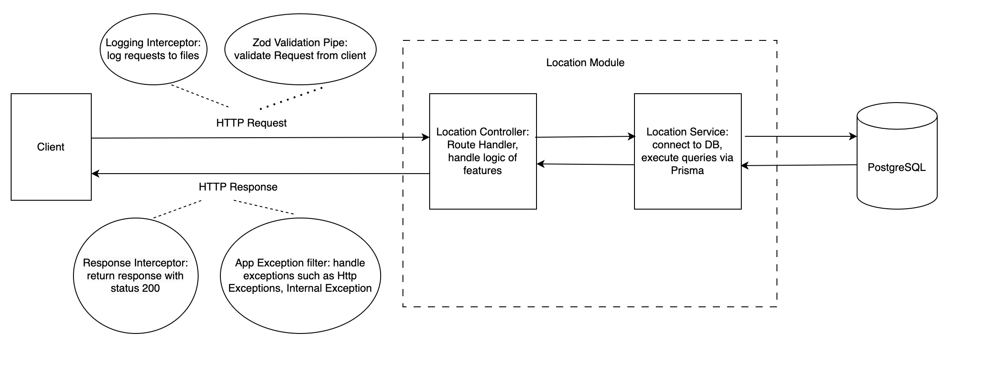

Application Documentation

1. Code Structure: 
The architecture follows the modular structure provided by NestJS, which organizes the codebase into modules, controllers, and services.

- Modules: Modules are used to organize related features together. Each module is responsible for a feature area.
- Controllers: Controllers handle incoming HTTP requests and return responses. They are tied to a specific route and call services to perform data operations.
- Services: Services contain the business logic and data operations. They are called by controllers and can call the Prisma ORM to interact with the database.
- Interceptors: Interceptors is layer that handles responses returned from controllers. We can use Interceptors to tranform data from controller into JSON object and return to Client. And we can use Interceptor to log HTTP request info or handle exepceptions.
- Pipes: Pipe is used for Request Validation. We create Validation Layer by using Pipe and Zod Library.
- Filters: I use Interceptors to handle HTTP exceptions (404, 403, etc) and other exceptions
- Prisma Schema: Define Database schema, migrate Database tables
- Prisma Client: this is ORM, in application we use Prismma client to connect to Databse and execute DB queries.

2. Main Components for Location Tree module 
- Location Module: This module is responsible for managing locations. It includes the LocationController, LocationService and other Services that we want to use
- LocationController: Handles HTTP requests related to locations. It includes routes for creating, retrieving, updating, and deleting locations.
- LocationService: Contains the business logic, data operations for managing locations, communicate with Database via Prisma

3. Architecture

